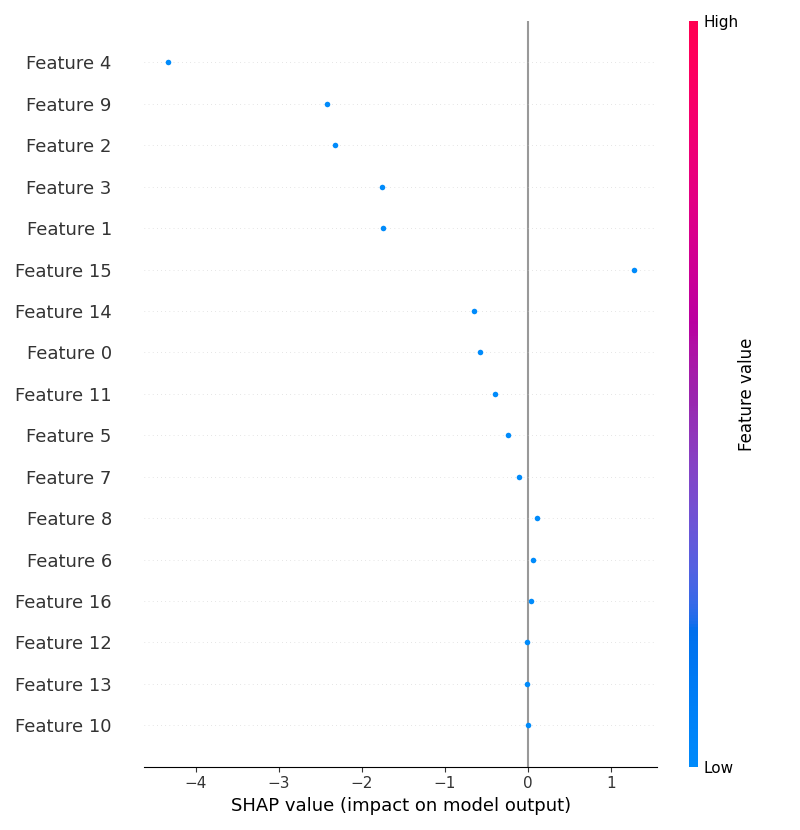

# 🚀 Customer Churn Prediction System (Production-Grade ML System)  
**End-to-End Machine Learning Project | Microservices Architecture | Real-Time API Deployment**

[](https://www.python.org/)
[](https://pandas.pydata.org/)
[](https://numpy.org/)
[](https://scikit-learn.org/)
[](https://xgboost.ai/)
[](https://fastapi.tiangolo.com/)
[](https://streamlit.io/)
[](https://render.com/)
[]()
[]()

---

# 📊 Project Overview

This project presents a **production-ready, end-to-end Machine Learning system** to predict customer churn using behavioral and transactional data.

Unlike traditional ML projects, this system follows a **real-world industry architecture**:

- ✅ End-to-end ML pipeline  
- ✅ REST API deployment (FastAPI)  
- ✅ Frontend-backend separation  
- ✅ Real-time prediction system  
- ✅ Monitoring & logging  

---

# 🎯 Business Problem

Customer churn is a critical issue for subscription-based businesses.

👉 Losing customers leads to:
- Revenue decline  
- Increased acquisition costs  
- Reduced lifetime value  

### 💡 Objective:
Build a system that predicts churn probability and enables **proactive retention strategies**.

---

# 🏗️ System Architecture (Month 5)

User Input (Streamlit UI)  
        ↓  
API Call (HTTP)
        ↓  
FastAPI Backend (Render) 
        ↓  
Feature Engineering Pipeline 
        ↓  
Trained ML Model (RandomForest / XGBoost) 
        ↓  
Prediction Output
       ↓  
Logging + Monitoring

---

📄 Detailed design available in: `docs/architecture.md`


---

# 🛠️ Tools & Technologies

| Category | Tools |
|--------|------|
| Programming | Python |
| Data Processing | Pandas, NumPy |
| Machine Learning | Scikit-learn, XGBoost |
| Backend | FastAPI |
| Frontend | Streamlit |
| Deployment | Render, Streamlit Cloud |
| Visualization | Matplotlib |
| Logging | CSV-based logging |
| Monitoring | Streamlit dashboard |

---

# 📂 Project Structure


Customer-Churn/
│
├── data/
├── models/
├── logs/
├── visualizations/
├── screenshots/
│
├── src/
│ ├── preprocessing.py
│ ├── train_model.py
│ ├── explainability.py
│ ├── visualize.py
│
├── api.py
├── app.py
├── requirements.txt
└── README.md


---

# 📊 Machine Learning Workflow

1. Data Collection  
2. Data Cleaning  
3. Feature Engineering  
4. Model Training  
5. Model Evaluation  
6. Model Selection  
7. API Deployment  
8. Monitoring & Logging  

---

# 📈 Model Performance

| Metric | Value |
|------|------|
| Accuracy | ~99% |
| Precision | High |
| Recall | Optimized |
| Model Used | RandomForest |

---

# 🔍 Feature Engineering

Custom features significantly improved performance:

- **Usage_Intensity** = Usage Frequency / Tenure  
- **Spend_per_Tenure** = Total Spend / Tenure  

📌 Ensured consistency between training and deployment pipeline

---

# 🚀 How to Run

## 1️⃣ Clone Repository


git clone https://github.com/AniketanandSandipkumar/Customer-Churn-Analysis-ML-Project.git

cd Customer-Churn-Analysis-ML-Project


---

## 2️⃣ Install Dependencies


pip install -r requirements.txt


---

## 3️⃣ Train Model


python -m src.train_model

---

## 4️⃣ Run Backend API


uvicorn api:app --reload


---

## 4️⃣ Run Application


streamlit run app.py


---

# 📡 API Usage

### Endpoint:POST /predict


### Example Request:

```json
{
  "Age": 30,
  "Gender": "Male",
  "Tenure": 12,
  "Usage Frequency": 10,
  "Support Calls": 2,
  "Payment Delay": 5,
  "Subscription Type": "Basic",
  "Contract Length": "Monthly",
  "Total Spend": 500,
  "Last Interaction": 10
}
```
---

# 📊 Project Preview

## Dashboard


## Prediction Output


## Model Explainability


---
# 🧪 Example Prediction

**Input:**
- Tenure: 12 months  
- Usage Frequency: High  
- Payment Delay: Moderate  

**Output:**

Churn Probability: 0.73

---

# 💡 Business Insights

- High usage + low tenure → high churn risk  
- Frequent payment delays increase churn probability  
- Support calls indicate dissatisfaction  
- Low spending consistency correlates with churn  

---

# 🔥 Key Highlights

- End-to-end ML pipeline  
- Production-ready modular code  
- Feature engineering consistency  
- Model versioning system  
- Interactive Streamlit dashboard  
- SHAP-based explainability  

---

# 🔮 Future Improvements

- Cloud deployment (AWS / Render)  
- Real-time prediction API  
- Advanced deep learning models  
- Customer segmentation integration  
- Automated retraining pipeline  

---

# 🧠 Learnings & Takeaways

- Transition from ML model → ML system 
- API-based deployment in real-world systems  
- Handling environment & dependency issues 
- Designing scalable ML architecture  

---

# 👨‍💻 Author

**Aniketanand Sandipkumar**  
Aspiring Data Scientist | Machine Learning Enthusiast  

📫 Open to internships, entry-level roles, and ML projects  

---
