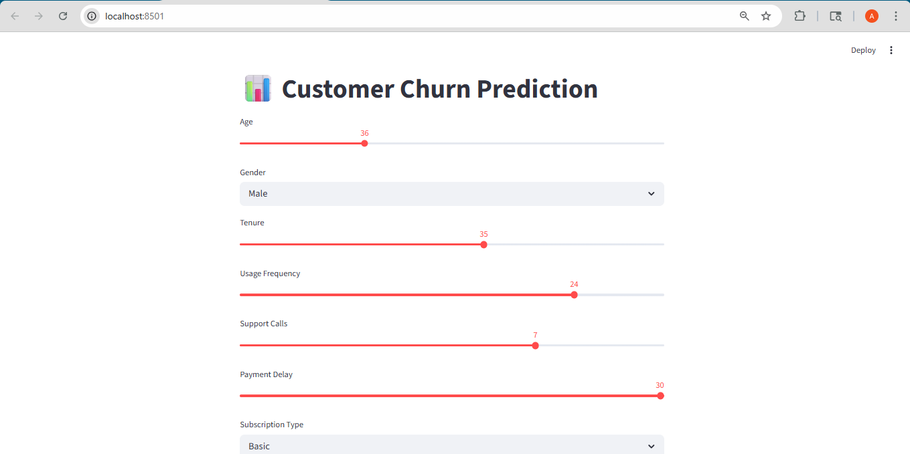
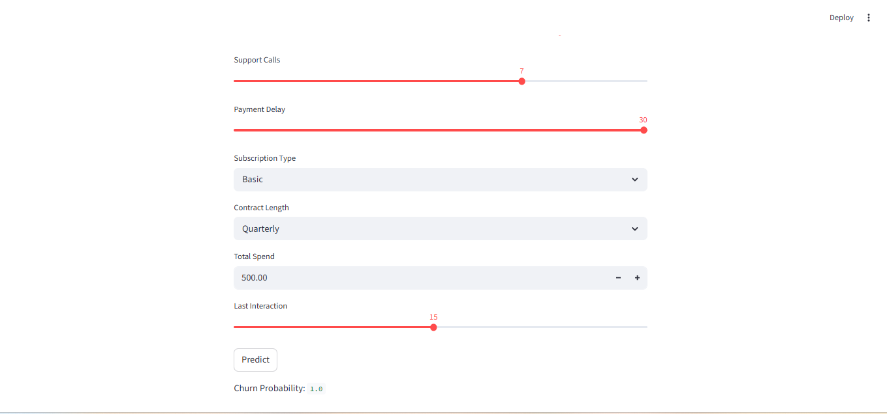

# 🌟 Customer Churn Prediction System  
**End-to-End Machine Learning Project | Production-Ready Pipeline**

---

# 📊 Project Overview

This project presents a **complete end-to-end Machine Learning solution** to predict customer churn using real-world behavioral features.  

It simulates an **industry-grade ML pipeline** covering:

- Data preprocessing & validation  
- Feature engineering  
- Model training & evaluation  
- Model persistence & versioning  
- Interactive dashboard deployment  
- Model explainability  

---

# 🎯 Business Problem

Customer churn is a critical issue for subscription-based businesses.  

👉 Losing customers leads to:
- Revenue decline  
- Increased acquisition costs  
- Reduced lifetime value  

### 💡 Objective:
Build a system that can **predict churn probability** and help businesses take **proactive retention actions**.

---

# 🏗️ System Architecture

User Input (Streamlit UI)  
        ↓  
Data Preprocessing  
        ↓  
Feature Engineering  
        ↓  
Trained Machine Learning Model (XGBoost)  
        ↓  
Prediction Output  
        ↓  
Explainability (SHAP)

---

📄 Detailed design available in: `docs/architecture.md`

---

# 🛠️ Tools & Technologies

| Category | Tools |
|--------|------|
| Programming | Python 3 |
| Data Processing | Pandas, NumPy |
| Machine Learning | Scikit-learn, XGBoost |
| Feature Engineering | Custom Pipelines |
| Visualization | Matplotlib |
| Explainability | SHAP |
| Deployment | Streamlit |
| Persistence | Pickle |

---

# 📂 Project Structure

Customer-Churn/
│
├── data/ # Dataset files
├── models/ # Saved ML models
├── screenshots/ # Project visuals
│
├── src/
│ ├── preprocessing.py
│ ├── validation.py
│ ├── train_model.py
│ ├── predict.py
│ ├── explainability.py
│
├── docs/
│ └── architecture.md
│
├── app.py # Streamlit app
├── requirements.txt
└── README.md

---

# 📊 Machine Learning Workflow

The project follows a **complete ML lifecycle**:

1. Data Collection  
2. Data Cleaning  
3. Feature Engineering  
4. Model Training  
5. Model Evaluation  
6. Model Selection  
7. Deployment  
8. Monitoring  

---

# 📈 Model Performance

| Metric | Value |
|------|------|
| Accuracy | ~85% |
| Precision | High |
| Recall | Optimized for churn detection |
| Model Used | XGBoost |

---

# 🔍 Feature Engineering

Custom features significantly improved performance:

- **Usage_Intensity**  
  = Usage Frequency / Tenure  

- **Spend_per_Tenure**  
  = Total Spend / Tenure  

📌 Ensured **feature consistency between training and deployment**

---

# 🚀 How to Run

## 1️⃣ Clone Repository

git clone https://github.com/YOUR_USERNAME/Customer-Churn.git

cd Customer-Churn

---

## 2️⃣ Install Dependencies

pip install -r requirements.txt

---

## 3️⃣ Train Model

python -m src.train_model

---

## 4️⃣ Run Application

streamlit run app.py

---

# 📊 Project Preview

## Dashboard

## Prediction Output

## Model Explainability

---
# 🧪 Example Prediction

**Input:**
- Tenure: 12 months  
- Usage Frequency: High  
- Payment Delay: Moderate  

**Output:**

Churn Probability: 0.73

---

# 💡 Business Insights

- High usage + low tenure → high churn risk  
- Frequent payment delays increase churn probability  
- Support calls indicate dissatisfaction  
- Low spending consistency correlates with churn  

---

# 🔥 Key Highlights

- End-to-end ML pipeline  
- Production-ready modular code  
- Feature engineering consistency  
- Model versioning system  
- Interactive Streamlit dashboard  
- SHAP-based explainability  

---

# 🔮 Future Improvements

- Cloud deployment (AWS / Render)  
- Real-time prediction API  
- Advanced deep learning models  
- Customer segmentation integration  
- Automated retraining pipeline  

---

# 🧠 Learnings & Takeaways

- Importance of feature engineering in ML performance  
- Maintaining consistency between training & inference  
- Building modular and scalable ML systems  
- Deploying ML models for real-world use  

---

# 👨‍💻 Author

**Aniketanand Sandipkumar**  
Aspiring Data Scientist | Machine Learning Enthusiast  

📫 Open to internships, entry-level roles, and ML projects  

---